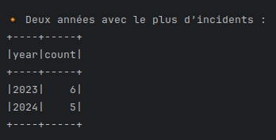

# 🧠 Activité Pratique : Analyse d’incidents avec Spark SQL en Java

Ce dépôt contient la solution de l’activité pratique portant sur le traitement de données avec **Spark SQL** en utilisant le langage **Java**.  
Ce TP est réalisé dans le cadre du cours de **Big Data** dispensé par **Mr Abdelmajid BOUSSELHAM**.

---

## 🎯 Objectif

L’objectif de ce TP est d’analyser un fichier CSV contenant les incidents déclarés par les différents services d’une entreprise.

Les deux objectifs spécifiques sont :

1. **Afficher le nombre d’incidents par service**
2. **Afficher les deux années où il y a eu le plus d’incidents**

---

## 📁 Structure du Fichier `incidents.csv`

Chaque ligne du fichier représente un incident avec les champs suivants :

| Champ        | Description                            |
|--------------|----------------------------------------|
| `id`         | Identifiant unique de l’incident       |
| `titre`      | Titre de l’incident                    |
| `description`| Description de l’incident              |
| `service`    | Service concerné                       |
| `date`       | Date de l’incident (format AAAA-MM-JJ) |

**Exemple** :
1,Panne réseau,Connexion lente,Informatique,2023-05-12
---


## ⚙️ Technologies utilisées

- 💻 Java 8+
- ⚡ Apache Spark SQL
- ☕ IntelliJ IDEA / Eclipse
- 📦 Maven pour la gestion des dépendances

---

## 📂 Structure du Projet

practical-activity-spark-sql/
├── src/
│ └── main/
│ └── java/
│ └── ma/
│ └── spark/
│ ├── Main.java # Classe principale
├── incidents.csv # Fichier de données d’entrée
├── pom.xml # Configuration Maven
└── README.md # Fichier de documentation


---

## 📌 Détail des classes

### `Main.java`

- Lit le fichier `incidents.csv` avec Spark SQL
- Crée une table temporaire pour requêter les données avec SQL
- Affiche :
  - Le nombre d’incidents par service
  - Les deux années avec le plus d’incidents (tri descendant)

---

## Captures d'écran

| Nombre d'incidents par service | Deux année ou il y'a plus incidents | 
|---|---|
|  |  | 

## ▶️ Instructions d’Exécution
1. **Cloner le dépôt** :
   ```bash
      git clone https://github.com/ouss-issib/practical-activity-spark-sql.git
      
2. Naviguer dans le répertoire du dépôt :
   ```bash
   cd practical-activity-spark-sql  

3. Compiler et exécuter les fichiers Java :
   ```bash
    mvn clean install
    spark-submit --class ma.spark.Main target/practical-activity-spark-sql-1.0-SNAPSHOT.jar


